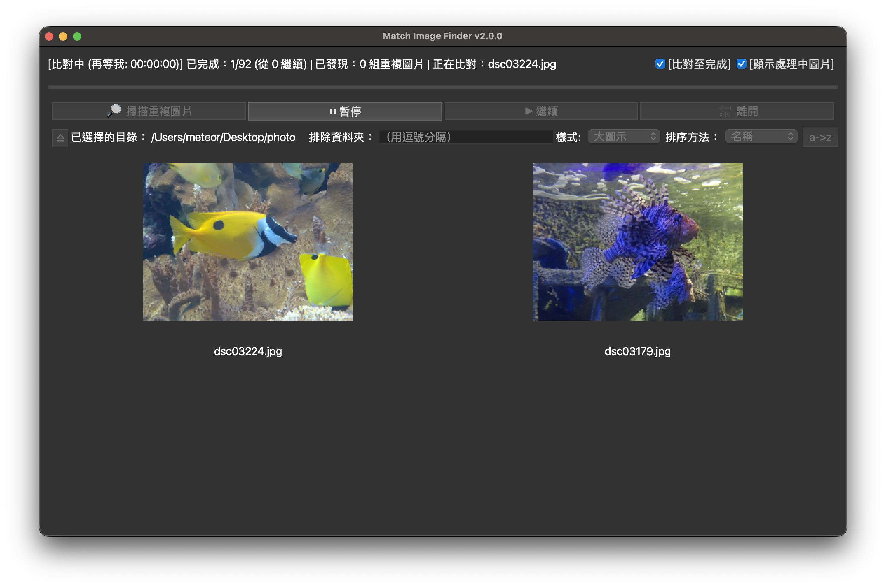
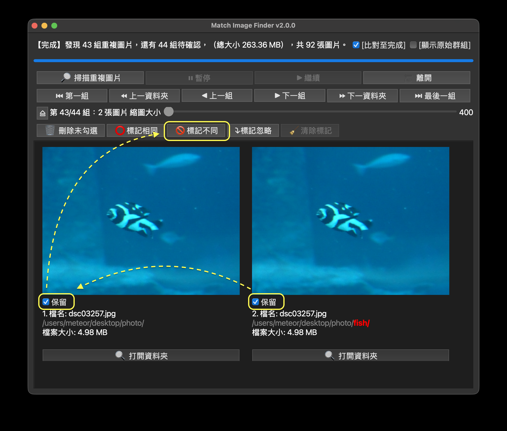
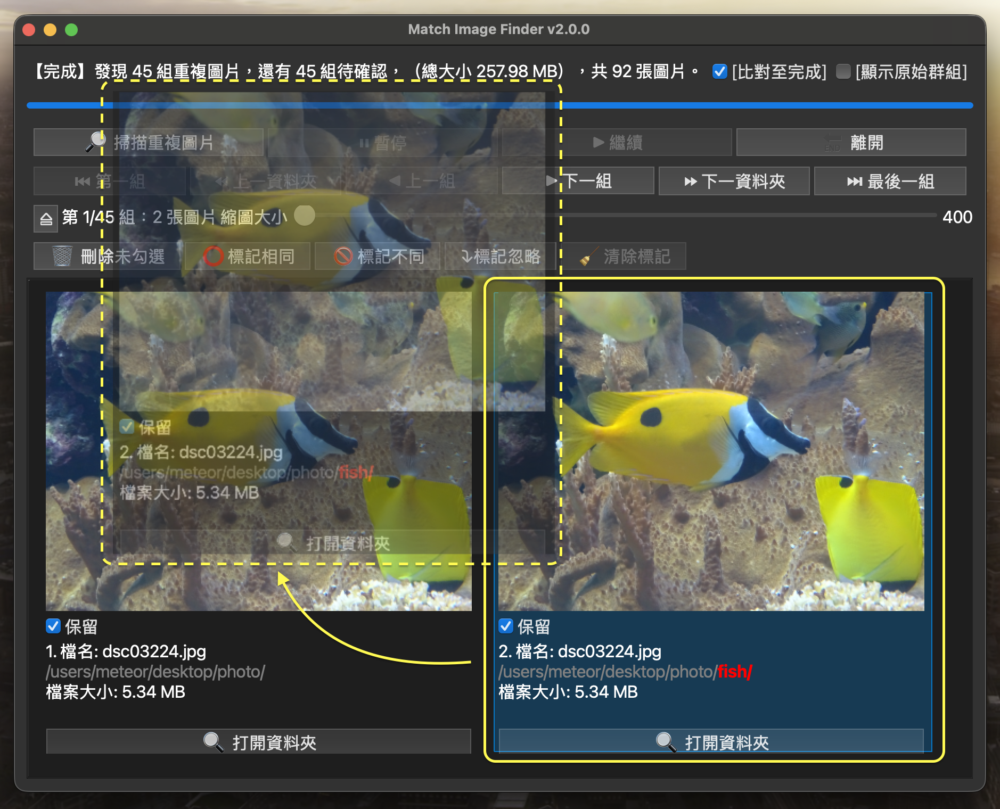

# Match Image Finder

基於排序機制的重複圖片檢測工具

## 功能特色
- 支援多平台：相容 macOS 與 windows
- 節省時間：快速找出相同照片



- 自己決定：重複圖片是否保留由你親自決定，避免電腦錯刪


- 方便紀錄：為整理過的圖片做標記



- 容易比較：可調整圖片排列順序，把相似圖片排在一起，方便比較



- 注重隱私：所有運算都在自己電腦進行，不需上傳圖片至雲端
- 自動儲存進度：比對結果自動保存

## 安裝與執行
支援以下兩種方式：
### 1. 以 Python 環境執行
支援 macOS 與 Windows。  
在終端機執行以下指令：

```bash
pip install -r Match_Image_Finder_requirements.txt
python Match_Image_Finder.py
```
### 2. 使用打包好的應用程式
* macOS：雙擊
Match_Image_Finder.app（目前僅支援 Intel CPU 版本）
* Windows：雙擊
Match_Image_Finder.exe

## 如何操作
請參照🔗 [繁體中文使用說明](./doc/Match_Image_Finder_Guide-tw.md)

## 授權方式
本專案採用 GPL License。你可以自由使用、修改、散佈本程式碼，但須遵守 GPL 條款。

## 版本歷史
### v2.0.0 2025-09-25
#### 新增功能
* 瀏覽檔案頁面，可瀏覽圖片檔案，並且新增/刪除/移動/重新命名檔案或資料夾
#### 執行檔下載 
* macOS版：[x86_64](https://github.com/Nick-0506/match_image_finder/releases/download/v2.0.0/Match_Image_Finder_v2.0.0.app.zip)
* Windows版：[x86_64](https://github.com/Nick-0506/match_image_finder/releases/download/v2.0.0/Match_Image_Finder_v2.0.0.exe)
### v1.2.0 2025-09-03
#### 新功能
* 在群組頁面新增拖曳功能，把類似的圖片放在附近，方便比較。
#### 變動
* 群組頁面開啟新視窗的方法，從按一下滑鼠左鍵變成按兩下。
* 排序群組內圖片。
* 調整總覽畫面的排列方式。
#### 執行檔下載 
* macOS版：[x86_64](https://github.com/Nick-0506/match_image_finder/releases/download/v1.2.0/Match_Image_Finder_v1.2.0.app.zip)
* Windows版：[x86_64](https://github.com/Nick-0506/match_image_finder/releases/download/v1.2.0/Match_Image_Finder_v1.2.0.exe)

### v1.1.0 2025-08-28
#### 新功能
* 新增總覽畫面，以每頁12張圖的方式瀏覽圖片。
* 新增標記功能，可以對圖片做相同/不同/忽略標記，也可以清除記號。
#### 變動
* 刪除按鈕的位置移動到群組畫面
* 群組畫面的圖片比較，從直排改成橫排
#### 修正問題
* 同一張圖片出現在多個群組
#### 執行檔下載 
* macOS版：[x86_64](https://github.com/Nick-0506/match_image_finder/releases/download/v1.1.0/Match_Image_Finder_v1.1.0.app.zip)
* Windows版：[x86_64](https://github.com/Nick-0506/match_image_finder/releases/download/v1.1.0/Match_Image_Finder_v1.1.0.exe)

### v1.0.0 2025‑08‑21
* 初版釋出，支援 phash 比對、GUI 操作等。
* 執行檔下載 macOS版：[x86_64](https://github.com/Nick-0506/match_image_finder/releases/download/v1.0.0/Match_Image_Finder_v1.0.0.app.zip) ; Windows版：[x86_64](https://github.com/Nick-0506/match_image_finder/releases/download/v1.0.0/Match_Image_Finder_v1.0.0.exe)
