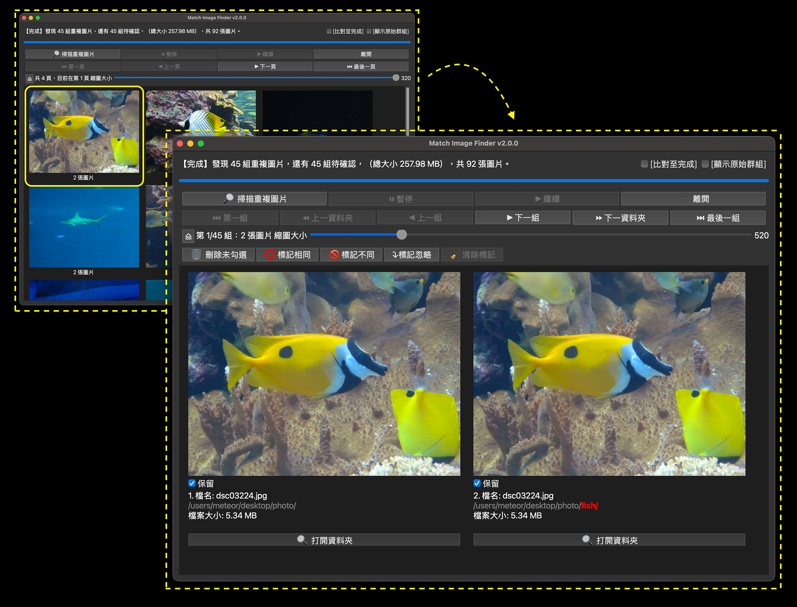
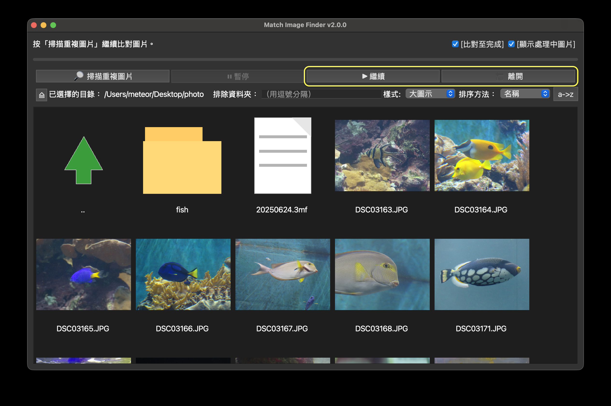
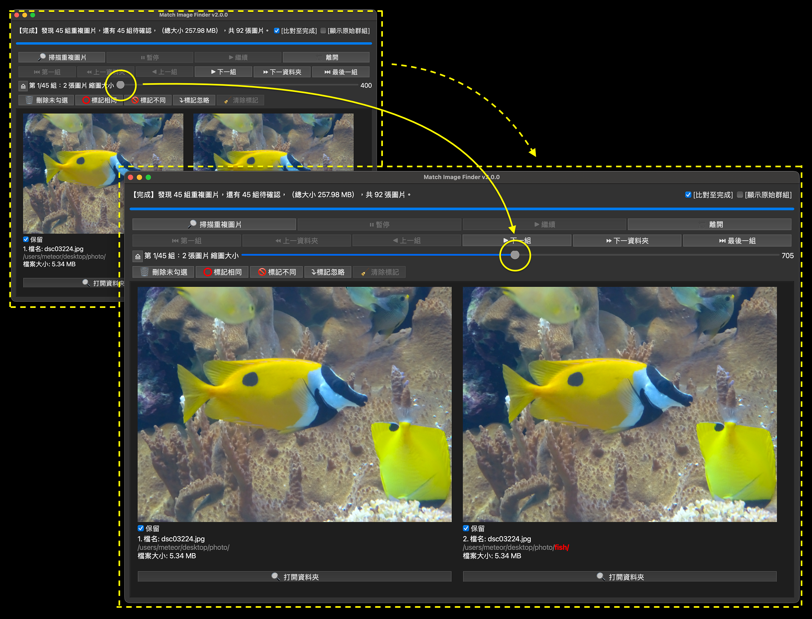
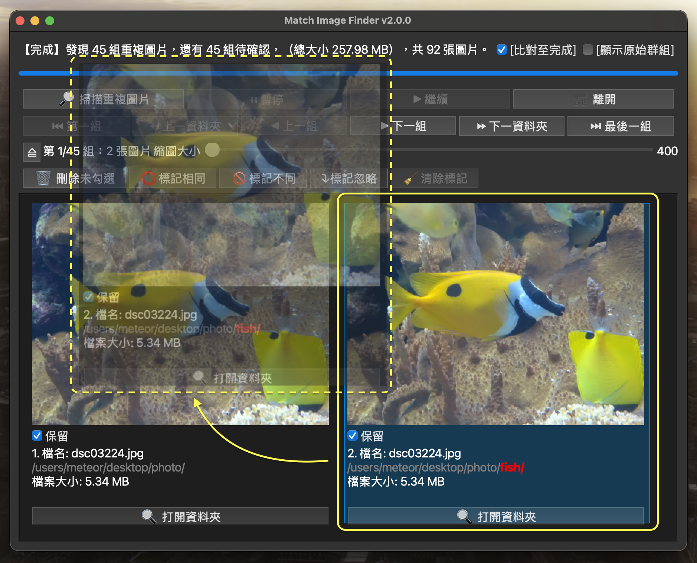
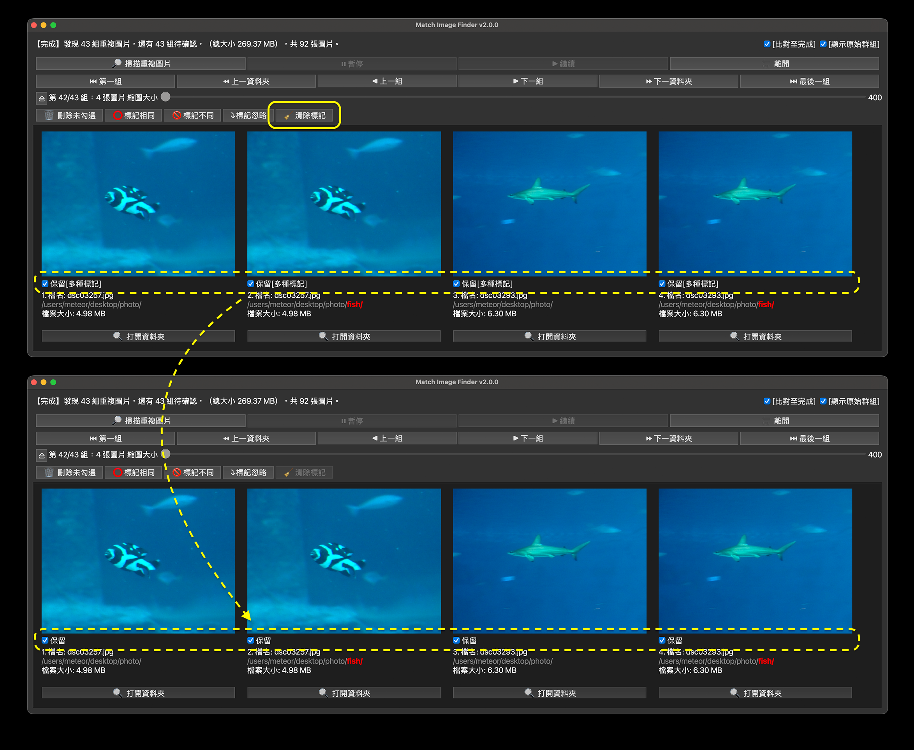
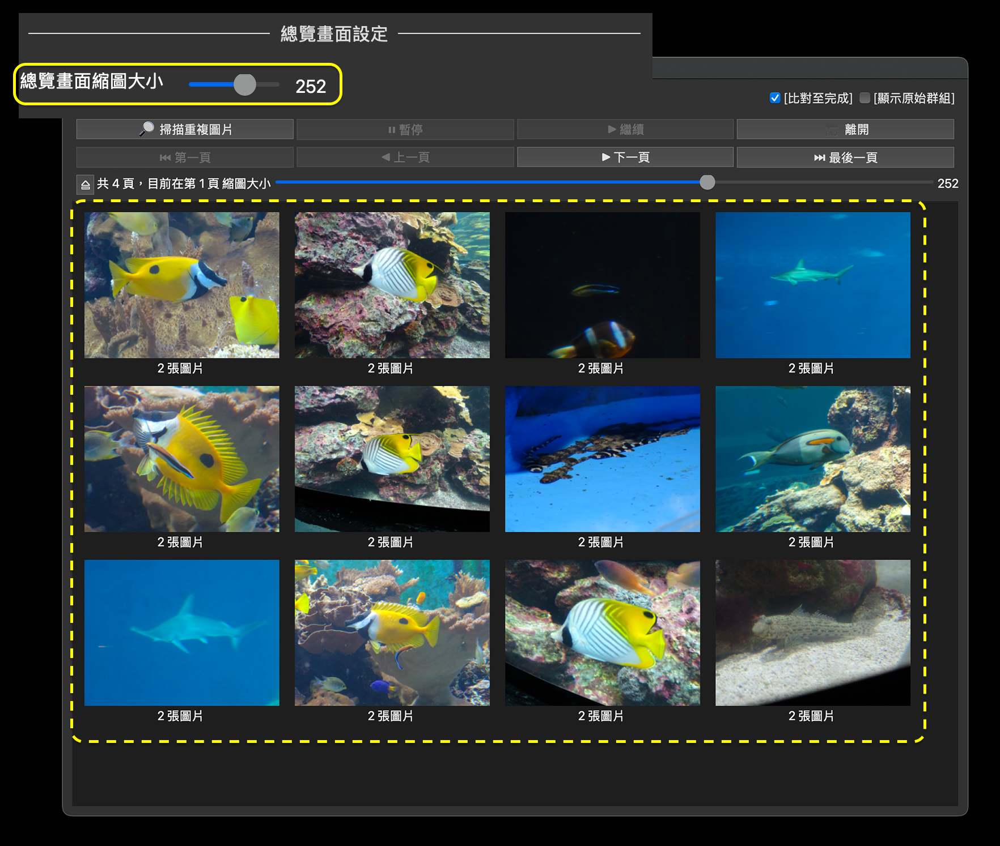

# 目錄
- [1. 快速開始](#1-快速開始)
>- [1.1 macOS使用者](#11-macos使用者)
>- [1.2 選擇資料夾 (2.0.0變更)](#12-選擇資料夾)
>- [1.3 確認選擇的資料夾](#13-確認選擇的資料夾)
>- [1.4 開始掃描圖片檔案](#14-開始掃描圖片檔案)
>- [1.5 找到重複圖片](#15-找到重複圖片)
>- [1.6 刪除重複圖片](#16-刪除重複圖片)
>- [1.7 繼續找重複圖片](#17-繼續找重複圖片)
>- [1.8 總覽畫面（1.1.0 新功能）](#18-總覽畫面)
>- [1.9 群組畫面（1.1.0 變更）](#19-群組畫面)
>- [1.10 離開](#110-離開)
- [2. 進階功能](#2-進階功能)
>- [2.1 重新開啟程式](#21-重新開啟程式)
>- [2.2 排除指定資料夾](#22-排除指定資料夾)
>- [2.3 比對至完成](#23-比對至完成)
>- [2.4 顯示處理中圖片](#24-顯示處理中圖片)
>- [2.5 暫停和繼續](#25-暫停和繼續)
>- [2.6 比較圖片（1.2.0 新功能和變更](#26-比較圖片)
>- [2.7 為圖片做分組標記（1.1.0 新功能）](#27-為圖片做分組標記)
>>- [2.7.1 相同標記](#271-相同標記)
>>- [2.7.2 不同標記](#272-不同標記)
>>- [2.7.3 忽略標記](#273-忽略標記)
>>- [2.7.4 清除標記](#274-清除標記)
>>- [2.7.5 被標記後的顏色區別）](#275-被標記後的顏色區別)
>- [2.8 瀏覽檔案畫面功能（2.0.0 新功能）](#28-瀏覽檔案畫面功能)
>>- [2.8.1 建立資料夾](#281-建立資料夾)
>>- [2.8.2 移動或複製檔案資料夾](#282-移動或複製檔案資料夾)
>>- [2.8.3 刪除檔案資料夾](#283-刪除檔案資料夾)
>>- [2.8.4 重新命名檔案資料夾](#284-重新命名檔案資料夾)
>- [2.9 驗證執行檔](#29-驗證執行檔)
- [3. 偏好設定](#3-偏好設定)
>- [3.1 語文](#31-語文)
>>- [3.1.1 語言](#311-語言)
>>- [3.1.2 字體大小比較圖片](#312-字體大小)
>- [3.2 檔案瀏覽畫面](#32-檔案總覽畫面)
>>- [3.2.1 顯示樣式](#321-顯示樣式)
>>- [3.2.1 排序方法](#322-排序方法)
>>- [3.2.3 顯示處理中圖片](#323-顯示處理中圖片)
>- [3.3 總覽畫面](#33-總覽畫面)
>>- [3.3.1 縮圖大小](#331-縮圖大小)
>>- [3.3.2 顯示原始群組](#332-顯示原始群組)
>- [3.4 群組畫面](#34-群組畫面)
>- [3.5 比對圖片設定](#35-比對圖片設定)
>>- [3.5.1 容許相似度](#351-容許相似度)
>>- [3.5.2 判斷為相同檔案時檔案大小要相同](#352-判斷為相同檔案時檔案大小要相同)
>>- [3.5.3 比對至完成](#353-比對至完成)
>- [3.6 檔案操作設定](#36-檔案操作設定)
>- [3.6.1 刪除檔案前顯示確認視窗](#361-刪除檔案前顯示確認視窗)
>- [3.6.2 顯示已知的重複圖片](#362-顯示已知的重複圖片)
- [4. 快捷鍵](#4-快捷鍵)
>- [4.1 共同支援](#41-共同支援快捷鍵如下)
>- [4.2 總覽模式](#42-總覽模式支援快捷鍵)
>- [4.3 群組模式](#43-群組畫面支援快捷鍵)
- [5. 技術資訊](#5-技術資訊)
- [6. 作者聲明](#6-作者聲明)

# Match Image Finder 操作說明

硬碟裡的圖片多到爆，有一些重複的圖片，其實可以刪除，節省磁碟空間。Match Image Finder可以幫助我們找出電腦中重複的圖片，以下說明如何用它找出重複圖片並且刪除它們。

**這個程式僅比對**
- 大於50KB的檔案
- 支援格式：.jpg, .jpeg, .png, .bmp, .gif, .cr2, .cr3, .nef, .nrw, .arw, .raf, .orf, .dng, .rw2, .heic

## 1. 快速開始
### 1.1 macOS使用者：
按住Ctrl點擊APP圖示（或按滑鼠右鍵），出現選單點一下打開

如果出現無法打開訊息，請點一下好
然後再一次按住Ctrl點擊APP圖示

當再次出現無法打開的視窗有打開的選項，請點一下打開

就可以順利開啟程式

* 如果還是無法打開，請開啟「系統設定」的「隱私權與安全性」的最下方找到被阻擋的「Match_Image_Finder...」
* 點強制打開

*再點強制打開

* 輸入登入密碼，按「好」

* 就可以順利開啟程式！
* 請注意！電腦鎖住不明來源程式，是為了資訊安全，請不要執行來路不明的程式。

### 1.2 選擇資料夾：
進入程式看到的是瀏覽檔案的畫面，首先介紹常見圖示和它們的功能
* 標示1：回上一層畫面或目錄，滑鼠左鍵點一下可以從群組畫面回到總覽畫面，或從總覽畫面回到瀏覽檔案畫面，如果已經在瀏覽檔案畫面會回到上一層資料夾。
* 標示2：回上一層目錄，滑鼠左鍵點兩下可以回到上一層目錄。
* 標示3：資料夾，滑鼠左鍵點兩下可以進入資料夾。
* 標示4：無法顯示圖片的檔案。
* 標示5：圖片檔案，滑鼠左鍵點兩下可以開啟圖片。
Windows版本才有的圖示
* 標示6：磁碟機，滑鼠左鍵點兩下可以進入磁碟機。
* 標示7：連接到共享資料夾，滑鼠左鍵點兩下可以輸入共享資料夾路徑，連到網路設備。

 ### 1.3 確認選擇的資料夾：
瀏覽到想要掃描的資料夾，確認顯示的資料夾名稱

### 1.4 開始掃描圖片檔案：
滑鼠左鍵點一下「掃描重複圖片」按鈕，程式會先找出資料夾內的圖片檔，然後計算每張圖片的哈希(Hash），最後進行相似度比對。

(如果圖片數量非常多，會需要幾個小時處理，請耐心等候)

### 1.5 找到重複圖片：
程式會暫停比對，並且顯示重複的圖片群組，我們可以
* [刪除重複圖片](#16-刪除重複圖片)
* [標記圖片](#27-為圖片做分組標記)
* [或繼續尋找下一組](#17-繼續找重複圖片)

### 1.6 刪除重複圖片：
用以下資訊決定要刪除哪些檔案
 1. [仔細比較圖片差異](#26-比較圖片)
 2. 檔案路徑，不同的部分有紅字提示
 3. 比較檔案大小

取消勾選要刪除的圖片然後點一下「刪除未勾選」 按鈕

看到確認訊息
* 確定按「是」，刪除檔案並且繼續找下一組重複圖片
* 取消按「否」，回到原本畫面

如果想直接刪除，不要跳出再確認視窗，可以[改變此設定](#361-刪除檔案前顯示確認視窗)。

### 1.7 繼續找重複圖片：
點一下「下一組」按鈕
重複步驟 [1.5](#15-找到重複圖片)、[1.6](#16-刪除重複圖片)、[1.7](#17-繼續找重複圖片)

### 1.8 總覽畫面：
比對完成時，程式會顯示「完成」
並且提供以下資訊：
* 找到多少組重複圖片
* 重複圖片的檔案大小
* 比對了多少幾張圖片
* 在總覽畫面列出重複照片，每頁14個群組（1.1.0新功能）

按「第一頁」、「上一頁」、「下一頁」、「最後一頁」按鈕瀏覽其他頁面

拉動滑桿可以調整縮圖大小，預設240，範圍120~320

滑鼠左鍵點兩下圖片進入群組畫面，比對圖片。

### 1.9 群組畫面
進入群組畫面，原本切換頁面的按鈕會變成切換群組功能，可以利用「第一組」，「上一資料夾」，「上一組」，「 下一組」，「下一資料夾」，「最後一組」按鈕切換顯示重複圖片組別。V1.1.0之後的版本，圖片排列方向改成水平排列。

在群組畫面按一下圖示「⏏️」回到總覽畫面，
在總覽畫面按一下圖示「⏏️」回到瀏覽檔案畫面

### 1.10 離開
點一下「離開」，結束程式。

## 2. 進階功能
資料夾內的圖片數量如果很大，會比較花時間，不一定能一次完成，可以先暫停再繼續比對。比對完成後能標記重複圖片，隱藏標記不同和忽略的群組。瀏覽檔案畫面能新增資料夾、移動檔案、複製檔案，還可以重新命名，完成基本的檔案管理。
### 2.1 重新開啟程式：
程式再開啟時會從上次結束程式時的資料夾開始，點[「掃描重複圖片」]就可以繼續上次未完成的[掃描](#14-開始掃描圖片檔案)。

如果選擇的資料夾有舊的比對結果，程式會詢問我們要重新掃描嗎？

選「是」，重新掃描，會花一點時間檢查檔案有沒有新增或刪除。
* 如果發現有圖檔已被刪除，程式會更新紀錄，不會再出現被刪除的圖檔
* 如果發現有新增圖檔，程式會紀錄新圖檔，並重新比對圖片

所以，上次掃描完資料夾後如果：
  * 知道有新增或刪除圖檔：請選擇「是」，重新掃描
  * 確定沒有變動：請選擇「否」，不重新掃描
  * 忘記有沒有變動：請選擇「是」，重新掃描

### 2.2 排除指定資料夾：
有時候我們希望程式不要掃描某些資料夾，可以輸入排除的資料夾名稱，然後按「掃描重複圖片」，程式會跳過指定的資料夾，縮短掃描的時間，找到的重複圖片可能會變少。

* 大小寫視為相同
* 包含指定文字的資料夾都會跳過
* 要略過多個子資料夾可以用逗號分開

例如：輸入RAW,Print，程式會忽略 RAW, Raw, printed 等資料夾

### 2.3 比對至完成：
如果我們沒有時間一直坐在電腦旁邊，馬上處理每一組比對結果，可以勾選「比對至完成」。打勾之後，找到重複圖片就「不會」暫停，而是繼續比對其他圖片，這樣我們就可以先去處理其他的事。比對完成，程式會顯示 [完成]...。

### 2.4 顯示處理中圖片：
如果想知道程式正在處理哪張圖片，可以勾選「顯示處理中圖片」，它會在進度條下方顯示目前圖片縮圖與檔名。

哈希中顯示

比對中顯示

我們可以悠閒地觀看比對過程，但這會增加處理時間，若要加快比對速度，把打勾取消就可以了！

### 2.5 暫停和繼續：
要讓電腦處理其他事情，可以按一下「暫停」，停止比對。程式會自動記錄哈希或比對進度。

暫停哈希

暫停比對

然後：
* 按「離開」，關閉程式。
* 或按「繼續」接著比對未完成的圖片。

### 2.6 比較圖片
如果因為縮圖太小，無法決定要留哪一張圖片，有幾個方法可以幫助我們：
* 調整縮圖大小：將縮圖大小的滑桿往右拉，可以放大縮圖。
（預設/最小：400；最大：1000）

* 瀏覽大圖：點兩下滑鼠左鍵，開啟新視窗顯示圖片(1.2.0 變更，在新視窗點兩下滑鼠左鍵關閉新視窗)。

* 開啟檔案所在資料夾：點一下「打開資料夾」

* 拖曳：將游標移動到圖片上，按住滑鼠左鍵，可移動圖片，把相似的圖片排在一起，方便比較(1.2.0 新功能)

### 2.7 為圖片做分組標記
當程式的圖片分組和我們想的不一樣時，可以利用標記圖片做調整。程式會記下我們對檔案的標記，不會直接修改圖檔。標記檔案的按鈕在「群組畫面」，如圖：

支援的標記種類有：
#### 2.7.1 相同標記：
當我們認為群組裡某些檔案相同跟其他不同時，只要把我們覺得一樣的檔案勾選起來，然後按一下「標記相同」按鈕，被選取的圖檔就會被建立新的群組和其他圖檔分開。
##### 範例：

有4張圖片，原本被歸類為相同圖片

* 點圖片進入群組畫面，可以看到4張圖片
* 選取第3和第4張圖片
* 按標記相同

* 結果，被勾選的圖片組成新群組，和原本的群組分開。

* 回到總覽畫面，原本的4張圖片群組被分成兩個群組

#### 2.7.2 不同標記：
當我們認為群組裡某些圖片彼此不一樣，卻被分類成相同，可以把這些檔案勾選起來，然後按一下「標記不同」按鈕，被標記的檔案就會變成獨立的圖案，不和任何其他圖檔相同，也不會顯示在總覽畫面和群組畫面。
##### 範例：
* 進入群組畫面，選取圖片1和2
* 按標記不同

* 結果，被標記不同的圖片會消失，回到總覽畫面也找不到剛才那組圖片。

#### 2.7.3 忽略標記：
當我們暫時不想處理這個群組，可以按一下「標記忽略」按鈕，這個群組就會被隱藏起來，不會顯示在總覽畫面和群組畫面。請小心！標記忽略的作用範圍是群組內的所有圖片，所以不需要特別勾選，如果沒有勾選任何圖片，一樣會被標記成忽略！
##### 範例：
* 進入群組畫面
* 這次我們想忽略圖片，點一下標記忽略按鈕

* 結果，因為忽略的群組不會顯示，總覽畫面也不會顯示這組圖片。

#### 2.7.4 清除標記：
如果想修改標記，可以按一下「清除標記」按鈕。和忽略標記一樣，清除標記的作用範圍是群組內的所有圖片，即使沒有選取的圖片，它們的標記也會被清除喔！
##### 清除「相同標記」範例：
* 進入群組畫面
* 點一下清除標記
* 標記就會被清除

* 回總覽畫面，顯示結果一樣，只是標記已被清除。

##### 清除「不同標記」和「忽略標記」範例：
因為標記成不同或忽略的群組已經被隱藏，需要打開「顯示原始群組」，才看得到它們。

* 這時候我們再點縮圖進入群組畫面
* 按清除標記按鈕，這個群組內的標記就會被清除了

* 回到總覽畫面，即使沒勾選選「顯示原始群組」，原本被隱藏的群組已經顯示在畫面上。

#### 2.7.5 被標記後的顏色區別
勾選「顯示原始群組」的情況下：
* 標記成忽略的群組，圖片以灰階呈現

* 標記成不同的群組，圖片以暗色呈現

### 2.8. 瀏覽檔案畫面功能
瀏覽檔案畫面可以對檔案或資料夾做建立資料夾、移動、複製、刪除和重新命名。以下介紹使用方法：

#### 2.8.1 建立資料夾
在瀏覽檔案畫面沒有檔案和資料夾的位置按滑鼠右鍵，跳出選單，點選建立資料夾。

輸入資料夾名稱後按確定，會在目前的目錄建立新資料夾。

如果在資料夾上按滑鼠右鍵，跳出的選單多一個「建立子資料夾」選項，一樣輸入資料夾名稱後，會在選定的資料夾中建立子資料夾。

#### 2.8.2 移動或複製檔案、資料夾
在瀏覽檔案畫面選擇檔案、資料夾

方法一：按滑鼠右鍵，在跳出的選單點選「移動到」或「複製到」

在跳出的視窗選擇要移動或複製的目的地，按確定。

方法二：按住滑鼠左鍵拖曳，是「移動」選擇的檔案、資料夾到目的資料夾，拖曳時按著cmd鍵(macOS)/ctrl鍵(windows)則是「複製」檔案、資料夾。

#### 2.8.3 刪除檔案、資料夾
瀏覽檔案畫面選擇檔案、資料夾，按滑鼠右鍵，在跳出的選單點選「刪除」

然後在跳出的確認視窗按是。

#### 2.8.4 重新命名檔案、資料夾
瀏覽檔案畫面選擇「一個」檔案或資料夾，按滑鼠右鍵，在跳出的選單點選「重新命名」。

然後輸入檔案、資料夾名稱按確定。

### 2.9 驗證執行檔：
這裡提供簡單的方式驗證執行的程式是不是原始公開的程式

左上角選單點選「說明」->「關於」

點一下「驗證 APP」

程式會連回github驗證程式有沒有經過第三方修改
* 驗證成功

* 驗證失敗

* 無法連線

## 3. 偏好設定
要改變程式的文字顯示、預設縮圖大小、容許相似度...等設定，可以在左上角選單點選「偏好設定」-> 「設定」修改。

支援的設定分成「1.使用者介面」和「2.行爲」兩部分。

修改設定後按「套用」會立刻使用新設定，按「確定」會立刻使用新設定並離開設定畫面。

### 3.1 語文
顯示的語言和文字大小。

#### 3.1.1 語言
調整程式使用的語言。語言設定只能在偏好設定更改。

繁體中文

英文

支援語言：自動、繁體中文、英文

預設：繁體中文

### 3.1.2 字體大小
調整顯示的字體大小。字體大小只能在偏好設定修改。

字體大小10

字體大小26

預設：12

範圍：8~28

### 3.2 檔案總覽畫面
顯示目前資料夾的檔案、資料夾，可以進行新增資料夾、移動、複製、重新命名等操作。滑鼠左鍵點擊資料夾兩下可以進入資料夾，點擊檔案可以放大圖片或顯示已知和被點擊的圖片重複的相關圖片。相關的設定如下：

#### 3.2.1 顯示樣式：

提供列表、小圖示、正常圖示、大圖示、巨圖示，五種選擇，可依照使用習慣設定。顯示樣式也可以直接在瀏覽檔案畫面中修改。

列表

小圖示

正常圖示

大圖示

巨圖示

預設：正常圖示

#### 3.2.2 排序方法：

檔案排列的順序，選項有名稱、修改時間、類型

也可以改變順序，a->z表示由小到大排列，z->a表示由大到小排列，按一下按鈕會改變順序，按鈕文字表示的是目前設定。排序方法可以直接在瀏覽檔案畫面中修改。

預設：名稱，a->z（小到大）

#### 3.2.3 顯示處理中圖片：

調整比對過程要不要顯示正在處理的圖片。顯示處理中圖片可以直接在瀏覽檔案畫面中修改。

顯示哈希中圖片

顯示比對中圖片

勾選：比對過程顯示正在處理的圖片，比對時間會比較長。

未勾選（預設值）：不顯示正在處理的圖片。

### 3.3 總覽畫面
顯示掃描出來的重複群組，滑鼠左鍵點擊圖片兩下可以進入群組頁面。相關設定如下：

#### 3.3.1 縮圖大小

總覽畫面顯示的縮圖大小，數字越大縮圖越大。這個設定也可以直接在總覽畫面修改。

預設：240

範圍：120~320

#### 3.3.2 顯示原始群組：

決定群組畫面顯示原始群組或標記後的群組。例如：有一個群組被標記忽略，這個群組就會被隱藏起來，要勾選「顯示原始群組」的時候才會被顯示出來。通常要修改標記時才會用到它。顯示原始群組也可以直接在總覽畫面或群組畫面中修改。

勾選：顯示原始群組。

未勾選（預設值）：顯示標記後的群組。

### 3.4 群組畫面
群組畫面顯示相同圖片群組，群組的照片可以按住滑鼠左鍵來拖曳圖片，改變排列，方便比較。重複的圖片可以刪除或標記相同、不同、忽略。
縮圖大小可以調整，數字越大縮圖越大。這個設定也可以直接在群組畫面修改。

預設：400

範圍：400~1000

### 3.5 比對圖片設定
這些設定會決定程式判斷圖片是否相同的條件，若要精確比對就把條件設定嚴格一點，若要模糊比對就把條件設定寬鬆一點。

#### 3.5.1 容許相似度
比對重複圖片時，容許多少差異視為相同。
數值大，差異大的圖片可能被識別為相同，可做模糊比對。數值小，差異大的圖片會被識別為不同，可做精確比對。容許相似度只能在偏好設定修改。

以下圖來說，相似度15的時候找到的組數比相似度5的時候少，表示有一些圖片被歸類在同一組了。

注意！以下情況會重新比對圖片：
* 改變設定時
* 選擇資料夾的使用的設定和目前設定不同時

預設：5

範圍：0~15

#### 3.5.2 判斷為相同檔案時檔案大小要相同
比對重複圖片時，要不要檢查檔案大小？勾選時除了圖片資訊要相同，檔案大小也要相同才會被視為相同圖片，可做精確比對。容許相似度只能在偏好設定修改。

勾選（預設）：檔案大小要一樣，才當作相同圖片。

未勾選：不考慮檔案大小。

以下情況會重新比對圖片：
* 改變設定時
* 選擇資料夾的使用的設定和目前設定不同時

#### 3.5.3 比對至完成

比對圖片時，暫停或是直接比對完所有照片？這個設定也可以在瀏覽檔案畫面、總覽畫面、群組畫面修改。

勾選（預設）：不停下來，直接比對完所有圖片。

未勾選：暫停，直到使用者按下一個。

### 3.6 檔案操作設定

設定刪除檔案或點擊檔案時的動作。 

#### 3.6.1 刪除檔案前顯示確認視窗
在群組畫面或瀏覽檔案畫片刪除圖片時要不要顯示確認視窗？取消這個設定會直接刪除檔案，可以讓操作更簡潔，但請小心誤刪檔案。這個設定只能在偏好設定修改。

勾選（預設）：顯示確認視窗

未勾選：不顯示確認視窗，直接刪除檔案

### 3.6.2 顯示已知的重複圖片
瀏覽檔案畫面的檔案按滑鼠左鍵兩下時，如果這個圖片檔有相同圖片，要開啟相同圖片群組嗎？這個設定只能在偏好設定修改。

勾選（預設）：開啟圖片群組

不勾選：改起此圖片的放大畫面

## 4. 快捷鍵
支援以下快捷鍵
### 4.1 共同支援快捷鍵：
| 按鍵 | 功能 | 支援的版本 |
|:--:|:--|:--:|
| O | 選擇資料夾 | v1.0.0 |
| S | 開始比對圖片 | v1.0.0 |
| P | 暫停比對圖片 | v1.0.0 |
| C | 繼續比對圖片 | v1.0.0 |
| Q | 離開程式 | v1.0.0 |
| cmd (macOS) or Ctrl (Windows) + , | 偏好設定 | v1.0.0 |

### 4.2 總覽畫面支援快捷鍵：
| 按鍵 | 功能 | 支援的版本 |
|:--:|:--|:--:|
| (Home) 或 F | 第一頁 | v1.1.0 |
| (Left) | 上一頁 | v1.1.0 |
| (Right) | 下一頁 | v1.1.0 |
| (End) 或 L | 最後一頁 | v1.1.0 |

### 4.3 群組畫面支援快捷鍵：
| 按鍵 | 功能 | 支援的版本 |
|:--:|:--|:--:|
| B | 回到總覽畫面 | v1.1.0 |
| (Home) 或 F | 第一組重複圖片 | v1.0.0 |
| (Up) | 上一個資料夾  | v1.0.0 |
| (Left) | 前一組重複圖片 | v1.0.0 |
| (Right) | 後一組重複圖片 | v1.0.0 |
| (Down) | 下一個資料夾 | v1.0.0 |
| (End) 或 L | 最後一組重複圖片 | v1.0.0 |
| (Backspace) 或 (Delete) | 刪除沒有選擇的圖片 | v1.0.0 |
| cmd (macOS) or Ctrl (Windows) + S | 標記選擇的圖片相同 | v1.1.0 |
| cmd (macOS) or Ctrl (Windows) + D | 標記選擇的圖片不同 | v1.1.0 |
| cmd (macOS) or Ctrl (Windows) + I | 標記選擇的圖片忽略 | v1.1.0 |
| cmd (macOS) or Ctrl (Windows) + U | 清除標記 | v1.1.0 |
| 0 | 全部選則/全部取消選擇 圖片 | v1.0.0 |
| 1~9 | 選擇/取消選擇 對號圖片 | v1.0.0 |

## 5. 技術資訊
* 支援系統： macOS / Windows11
* .progress、.filelist、.exceptions、.constraints、.duplicate.lock 五個檔案是程式使用，請不要任意改變它們

## 6. 作者聲明
* 作者：Nick Lin（snl0506@yahoo.com.tw）
* 發佈時間：2025 年 9 月 25 日
* 對應軟體版本：2.0.0